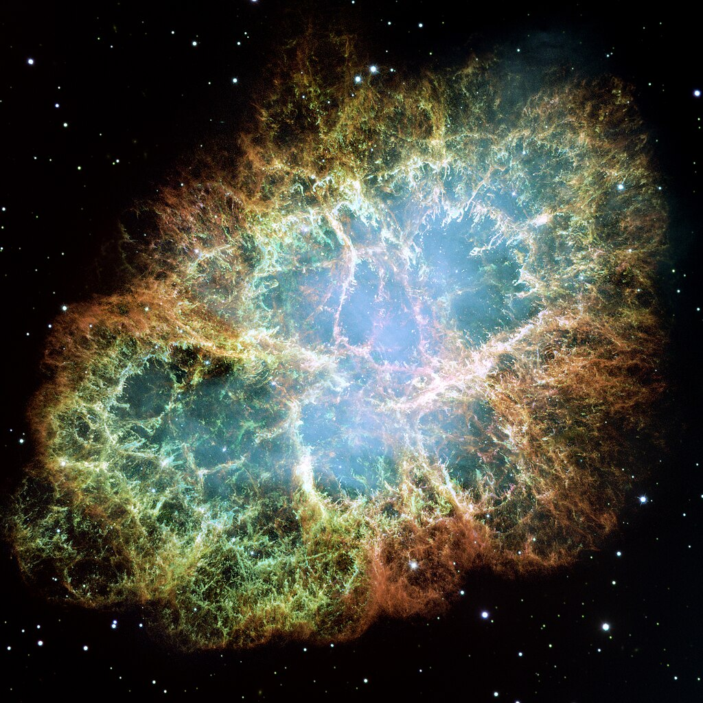

# Welcome to My Research Page
11111.

## Here is an equation

$$ x = \frac{-b \pm \sqrt{b^2 -4ac}}{2a}$$

## Here is the Crab Nebula

I got this image from [Wikipedia](https://en.wikipedia.org/wiki/Crab_Nebula).
